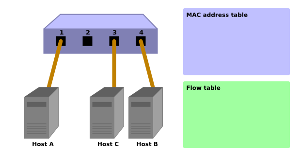
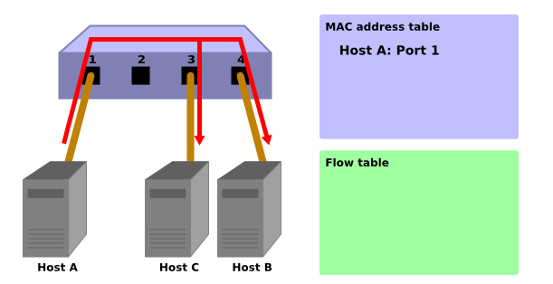
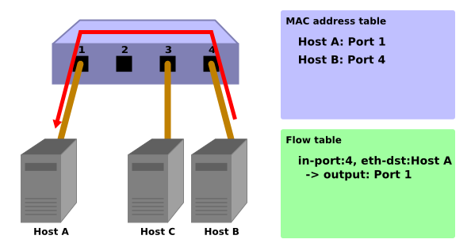
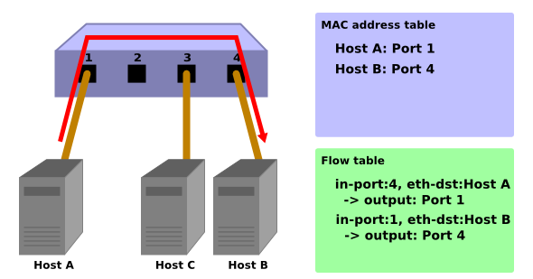

# << SDN 控制器 >>

### [ 封包傳遞示意流程 ]

#### -------------------------- FLOOD 機制 ------------------------------

<p>
    &emsp;&emsp;使用Packet-In功能來學習MAC地址。控制器可以使用 Packet-In 功能從交換機接收數據包。交換機分析收到的數據包，了解主機的MAC地址和連接端口的信息。
</p></>
<p>
    &emsp;&emsp;交換機學習後轉發接收到的數據包。交換機調查數據包的目的 MAC 地址是否屬於學習到的主機。根據調查結果，交換機執行以下處理。
</p>
    
- 如果主機已經是學習主機 ... 使用 Packet-Out 函數從連接的端口傳輸數據包。
- 如果host是unknown host ... 使用Packet-Out函數進行泛洪。

#### ---------------------------- 傳遞流程 ------------------------------

1. 初始狀態
<br/>
    <p>
        &emsp;&emsp;這是流表為空的初始狀態。<br/><br/>
        &emsp;&emsp;假設主機 A 連接到端口 1，主機 B 連接到第 4 部分，主機 C 連接到端口 3。
    </p>



2. Host A -> Host B
<br/>
    <p>
        &emsp;&emsp;當數據包從主機 A 發送到主機 B 時，發送一個 Packet-In 消息，主機 A 的 MAC 地址被端口 1 學習。由於主機 B 的端口尚未找到，數據包被泛洪並被接收主機B和主機C。
    </p>



Packet-In :

```bash
in-port: 1
eth-dst: Host B
eth-src: Host A
```

Packet-Out :

```bash
action: OUTPUT:Flooding
```

3. Host B -> Host A
<br/>
    <p>
        &emsp;&emsp;當數據包從主機 B 返回到主機 A 時，流表中會添加一個條目，並且數據包也會傳輸到端口 1。因此，主機 C 不會收到數據包。
    </p>



Packet-In :

```bash
in-port: 4
eth-dst: Host A
eth-src: Host B
```

Packet-Out :

```bash
action: OUTPUT:Port 1
```

4. Host A -> Host B
<br/>
    <p>
        &emsp;&emsp;同樣，當數據包從主機 A 發送到主機 B 時，一個條目被添加到流表中，並且數據包也被傳輸到端口 4。
    </p>



Packet-In :

```bash
in-port: 1
eth-dst: Host B
eth-src: Host A
```

Packet-Out :

```bash
action: OUTPUT:Port 4
```

### [ 封包傳遞原理 ]


- What is ARP ?
    =>  [[網路] 淺談 ARP (Address Resolution Protocol) 運作原理](https://blog.downager.com/2013/07/03/%E7%B6%B2%E8%B7%AF-%E6%B7%BA%E8%AB%87-ARP-Address-Resolution-Protocol-%E9%81%8B%E4%BD%9C%E5%8E%9F%E7%90%86/) 。

- What is ICMP ?
    => [TCP/IP 協定與 Internet 網路：第五章 網際層協定](http://www.tsnien.idv.tw/Internet_WebBook/chap5/5-4%20ICMP%20%E9%80%9A%E8%A8%8A%E5%8D%94%E5%AE%9A.html) 。

